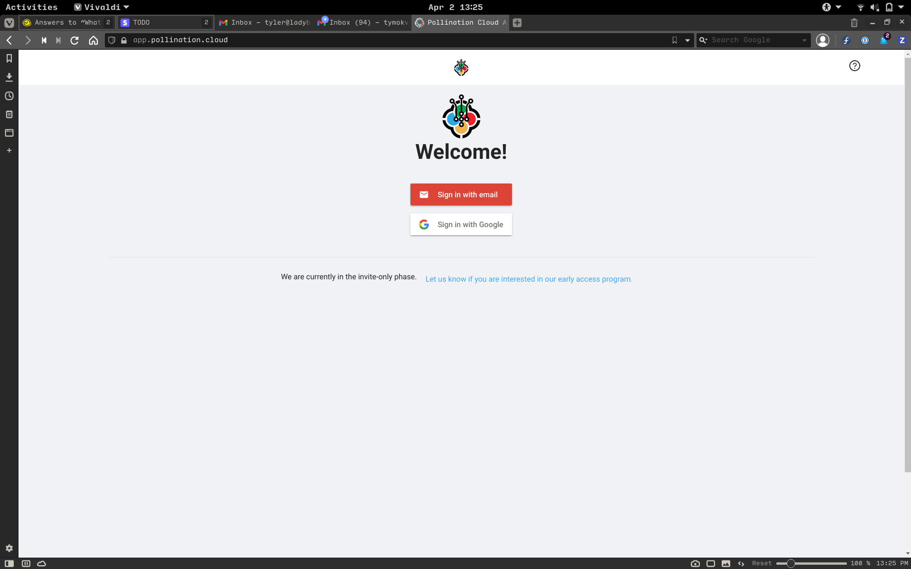
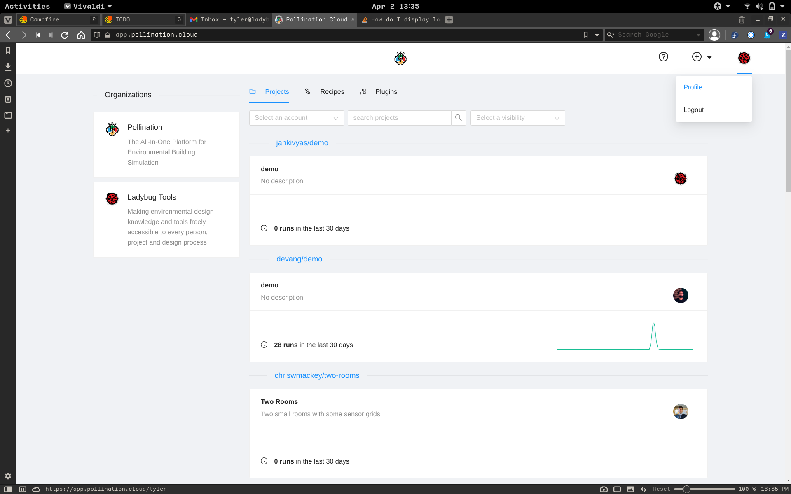
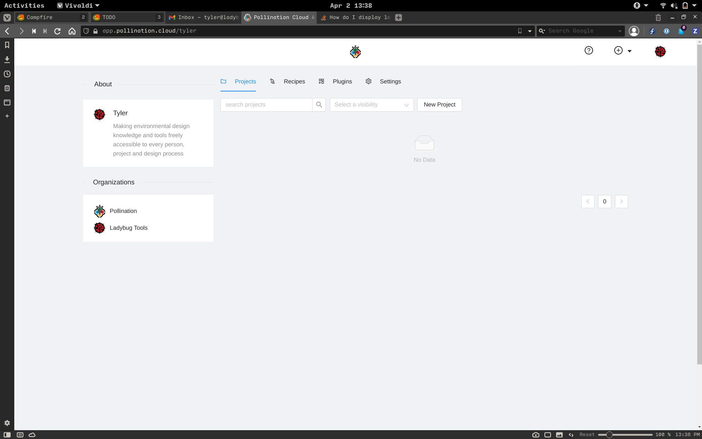
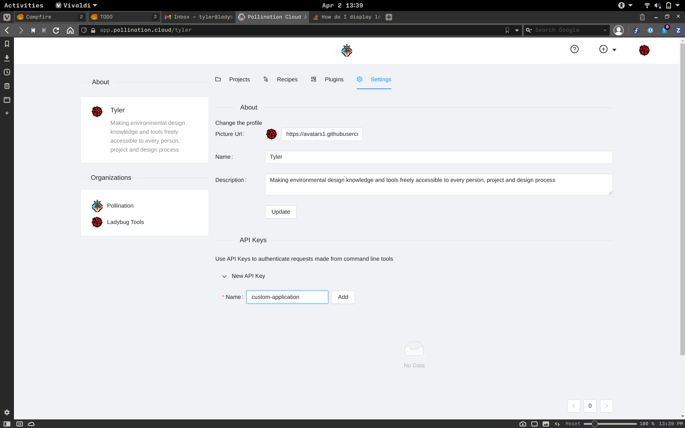
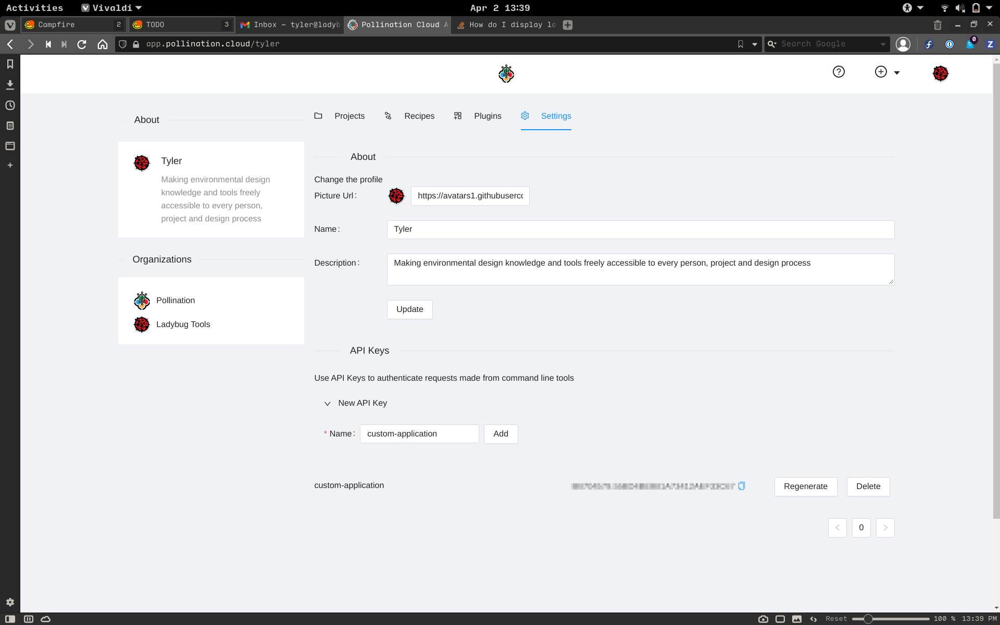
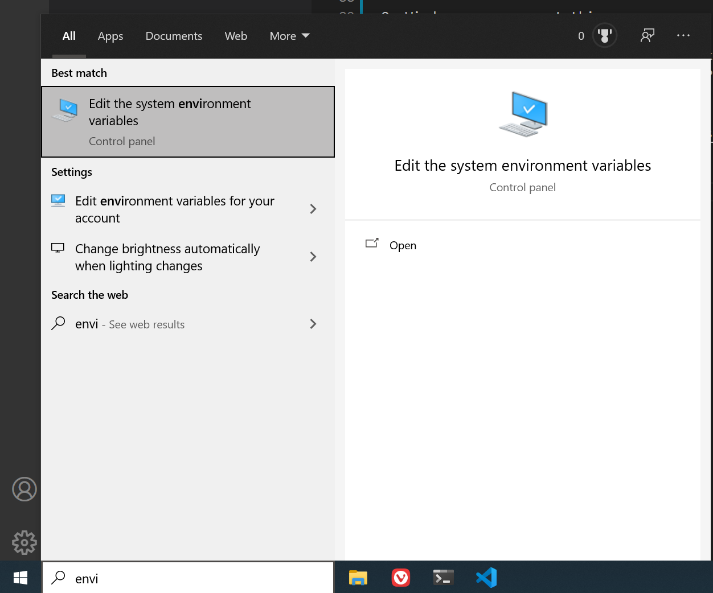
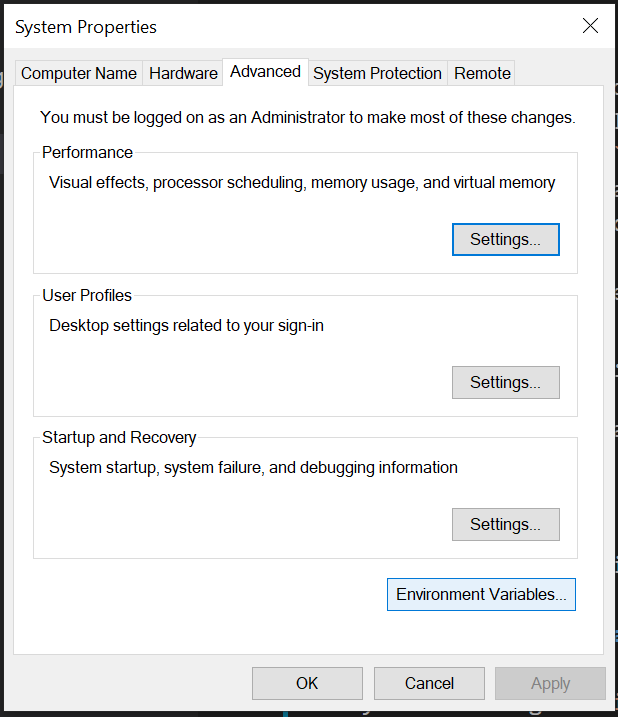
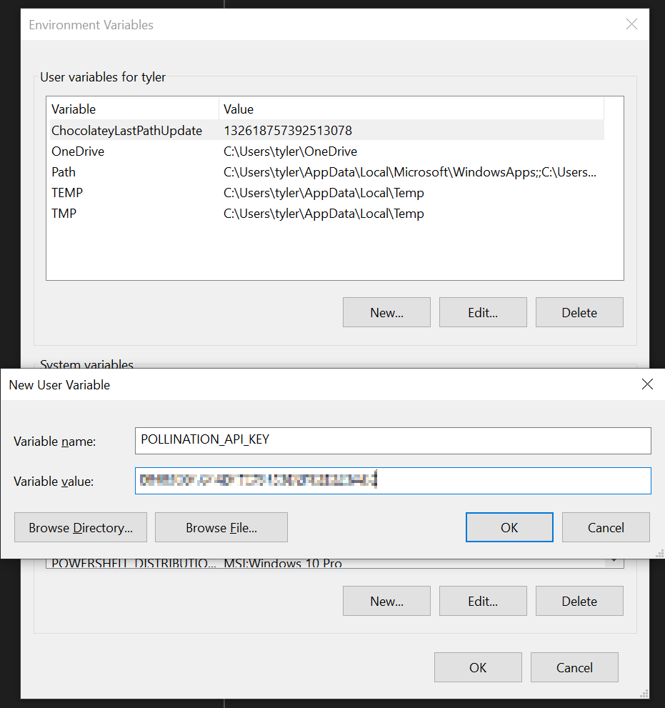

# Developer Quickstart

Get up and simulating with the Pollination API!

This guide has three sections:

1. [Obtain an API key](#obtain-api-key)
2. [Use the REST API directly](#use-the-rest-api)
   - Write a simple "get my user" application
   - Examine a longer "Start job, monitor, retrieve results" application

## Prerequisites

1. Have an active [app.pollination.cloud][poll-app] account
1. Some familiarity with command line tools and scripting
1. Familiarity with Python 3 will help, but is not required

[poll-app]: https://app.pollination.cloud

If, at any point, you get stuck or have feedback, please feel free to reach out
on the [Pollination Discourse][poll-disc].

[poll-disc]: https://discourse.pollination.cloud

## Obtain API Key

A key feature of Pollination is to be able to use the application independently
of any particular interface. The browser application, CAD/BIM plugins, and
client SDKs all use the same RESTful API to simulate at scale.

In order to unify access the diverse access modes with one identity, your
account allows you to create API keys in the browser application that can be
used for any existing or custom integration with the API.

### Log in

Depending on how you signed up, either log in with your email or using OAuth
with Google.



Once you have signed in, you will see the Pollination dashboard. In the top
right, click on your avatar to reveal the `Profile` link.



After navigating to your profile, you will see a (possibly empty) view of your
projects. This will be populated by the end of this tutorial as we will create
a project.

From here, click the `Settings` tab to navigate to the next screen.



In the `Settings` screen, there will be a section near the bottom for your API
keys. Drop down the `New API Key` menu, enter a name for the key (I have used
`custom-application`, but you may want to use something more meaningful for
your purposes), and click `Add` to generate a key for this name.



After clicking add, you will see the key's name and value under the dropdown.
It is a best practice to generate one API key per application that you create
as this will allow them to be revoked from test applications without affecting
production applications, for instance.

Remember:

:stop_sign: :warning:

**API Keys are like passwords!**

:warning: :stop_sign:

Once you generate it, store it in a secure location, as they can trigger
billable actions to your account, and will not be visible once you navigate
away from this page. If you ever need to revoke access to an API key, you can
click the `Regenerate` button to get a new value. Or, click `Delete` to remove
it permanently. Naturally, in either case, any application using the key will
need to be updated accordingly.

You can copy the value using the button to the right of the generated key.
Once you have this in a secure location, you are ready to move on.



The final piece of information that you will need is your username from the
end of the URL bar. We will use this to associate all of our API calls to our
personal accounts. Here, mine is `tyler`.

Save this value as we will need it in the next section.

## Use the REST API

In this section, we will write a simple Python script to use the API.

### Set Environment Variables

If you are using a `nix` operating system, you can simply `export POLLINATION_API_KEY=your api key` and `export POLLINATION_ORG=your username`.

They will need to be set for every invocation of the following scripts, so it
can be useful to set them in your `.bashrc` or equivalent.

---

On Windows, you can set this by searching for `environment` in the Start Menu.



After clicking on `Edit the system environment variables` you should see a
system properties dialog.



Clicking on the `Environment variables` button will reveal the environment
variable editor. Clicking `New` will open an editor dialog. Set the name to
`POLLINATION_API_KEY` and paste in the value that was copied from the
Pollination settings page previously.



Now, we can access the value securely from any application running on the host
system.

You will also need to set an environment variable named `POLLINATION_ORG` to
the name of the organization or user that you copied from the URL bar.

### Call the API

The API documentation can be viewed as an
[interactive OpenAPI client][poll-oapi] or in [ReDoc format][poll-redoc]. These
pages are generated directly from the application code whenever the server is
redeployed, so they are always the most up-to-date reference.

[poll-oapi]: https://api.pollination.cloud/docs
[poll-redoc]: https://api.pollination.cloud/redo

The API key from the previous section needs to be included in a
Pollination-specific header `x-pollination-token`.

We will use the library `httpx` to create a client that inserts this header for
all requests. You will need to `pip install httpx`.

In this step, we will make a class `PollinationClient` which handles
authentication and sets the base URL for all requests to the Pollination API
server to reduce repetition. We can then add methods to this class for API
actions that we wish to take that wrap the corresponding endpoint.

The source for this script can be found in
[`get_user.py`](./get_user.py).

```python
import os
import httpx
from pprint import pprint as print

class PollinationClient(httpx.Client):
    """
    An HTTP client specific to the Pollination REST API.
    """
    class Endpoints:
        user = '/user'
        accounts = '/accounts'
        accounts_name = accounts + '/{name}'

    def __init__(self, *args, **kwargs):
        super().__init__(*args, **kwargs)

        self.base_url = 'https://api.pollination.cloud'

        self.headers['x-pollination-token'] = os.environ['POLLINATION_API_KEY']

        self.organization = os.environ['POLLINATION_ORG']

    def _org_endpoint(self):
        return (
            self
            .Endpoints
            .accounts_name
            .format_map(dict(name=self.organization))
        )

    def get_organization(self) -> dict:
        res = self.get(self._org_endpoint())

        return res.json()


client = PollinationClient()

org = client.get_organization()

print(org)
```

If you see the JSON representation of your account printed to the
console...

#### Congratulations!

You have the basic pieces in place to build a custom application using the
Pollination API.

The next section will use a module that is significantly larger, but
essentially the same as this one.

### Use the API to Simulate at Scale

The next script will be a bit longer as it will actually start a job using a
recipe and 3D models that have already been encoded in HBJSON format.

The samples use Python 3, but any coding environment that can make HTTP
requests is sufficient. (You could even use `curl`!)

The full source for this script can be found in the [`rest-api`](./rest-api)
directory. To increase readability, the source is split into a module that
demonstrates wrapping the REST API with an HTTP client library and a file that
uses this module to make the actual requests. Here, we will look at snippets
making the actual requests, but you are encouraged to download the sample files
and run the code from a Python virtual environment. The demo models and recipe
are simple, so they will run quickly.

One of the benefits of using Pollination is that you can run the same
simulation parameterized across multiple models and settings simply by
submitting different lists of inputs.

We will use two models to show how to run the same simulation with two options
for a facade system. The models are included as siblings to the Python source
files in the [`rest-api`](./rest-api) folder.

You should be able to open a console from inside the same folder, run `pip install -r requirements.txt`, run `python main.py`, and watch as the script
creates a parametric job with runs for each of the two models.

Because Pollination scales compute to meet a Job's demand, running the two
simulations in parallel takes about the same amount of time as running either
of the individually.

#### Explanation

The example application has the following steps:

1. Create a client
1. Create a project
1. Add a recipe filter to the project
1. Create project artifacts for each of the two 3D models
1. Use these artifacts to create arguments to two runs of the same recipe
1. Submit a job with the selected recipe and arguments
1. Poll the job as it runs until it completes
1. Select the two runs that were created for the two 3D models
1. Download the simulation results for both runs back to the local machine

#### Client

Similar to above, we inherit from `httpx.Client` to have the authorization
headers inserted in each request and to keep the HTTP session open.

```python
client = PollinationClient()
```

#### Project

We create a public project with a meaningful name and description. The name
will be necessary to create further resources tied to the project, so this is a
useful object to keep around for the rest of the script to refer to.

The project only needs to be created once and can be used for as many jobs as
necessary. If you run the script multiple times, you will notice that, on
subsequent invocations, the response indicates a project with the name already
exists. This is safe to run as Pollination will simply respond with an "already
exists" status to calls that attempt to create a project with the same name as
one that exists in an account.

We will set the `public` field to `False` since this is just a test project.

```python
project = Payload.Create(
    name='good-project',
    description='A very good project',
    public=False
)
```

#### Recipe Filter

The recipe filters applied to a project affect which recipes are available to
be used for future jobs. Here, we select a simple public recipe for calculating daylight factor which is provided by Ladybug Tools.

```python
recipe_filter = Payload.RecipeFilter(
    owner='ladybug-tools',
    name='daylight-factor',
    tag='0.5.6'
)
```

#### Create Artifacts

The two model files that were downloaded above need to be submitted as
artifacts which belong to the project in order to use them for jobs. Here, we
upload them and also use the `queenbee` library to create a list of
`arguments` to the recipe.

The `arguments` variable is a list of lists. The first level of the list will
be in 1:1 correspondence with the runs that are created. The second level
corresponds to the arguments that the recipe we are using can accept. In this
case, we provide two different models to the `model` input of the recipe.

```python
file_names = ['model1.hbjson', 'model2.hbjson']
arguments = []

for name in file_names:
    artifact = Payload.Artifact(key=name)
    res = client.add_file_to_project(project.name, artifact)
    print(res)

    # Construct an argument to the job for the 3D model that was uploaded
    project_artifact = ProjectFolder(path=artifact.key)
    model_argument = JobPathArgument(
        name='model',  # This corresponds to a named input from the recipe
        source=project_artifact
    )

    # Wrap each argument in its own list to parameterize
    arguments.append([model_argument])
```

#### Simulate! (Create a Job)

We use the recipe filter and the base URL of the Pollination server to create a
link to where Pollination can find the recipe that we would like to use.

The `arguments` array is passed to the `Job` payload to indicate we would like
to start two runs, one for each model artifact that was uploaded.

```python
recipe_source_url = '/'.join(
    [
        str(client.base_url),
        'registries',
        recipe_filter.owner,
        'recipe',
        recipe_filter.name,
        recipe_filter.tag
    ]
)

# Create a job
job = Payload.Job(source=recipe_source_url, arguments=arguments)
res = client.create_job(project.name, job)
```

#### Poll the Job

While the job is executing, we simply loop to watch it for progress.

```python
job_id = res.json()['id']

# Poll the created job until it is in an end state
remaining_polls = 5
wait_sec = 60
print(
    f'Waiting up to {remaining_polls * wait_sec} sec for job to finish...'
)

while remaining_polls > 0:
    res = client.get_job(project.name, job_id)
    body = res.json()
    job_status = body['status']['status']

    if job_status == 'Completed':
        print('Job finished!')
        break

    if job_status == 'Cancelled':
        print('Job cancelled!')
        exit()

    time.sleep(wait_sec)  # Wait for job to finish
    remaining_polls -= 1
    print(f'{remaining_polls} attempts remaining')
```

#### Get Outputs from Completed Runs

Once the job has finished, we can select the runs that it created. Here, we
only had two. But, you can use a similar approach to run simulations across
dozens of design options and/or with different parameters to the simulation
engines.

For each of the runs, we download the ZIP file of all of the simulation's
results.

```python
res = client.get_runs(project.name, job_id)

body = res.json()

for run in body['resources']:
    run_id = run['id']
    # The selected recipe determines the outputs
    run_output_name = run['status']['outputs'][0]['name']

    # Get a download link for the run output
    res = client.get_run_output(project.name, run_id, run_output_name)
    url = res.json()

    # Save to a local file
    urlretrieve(url, f'{run_id}-{run_output_name}.zip')
```

You should see two files created on your local machine, named for the UUID of
the run that Pollination executed. Inside each file will be the simulation
results for the corresponding 3D model.

### Fin

And that's it! You have now created a project and used it to create a
parametric job to calculate the daylight factor of two different 3D
models simultaneously!
